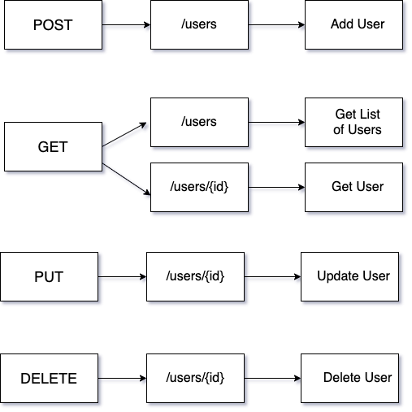
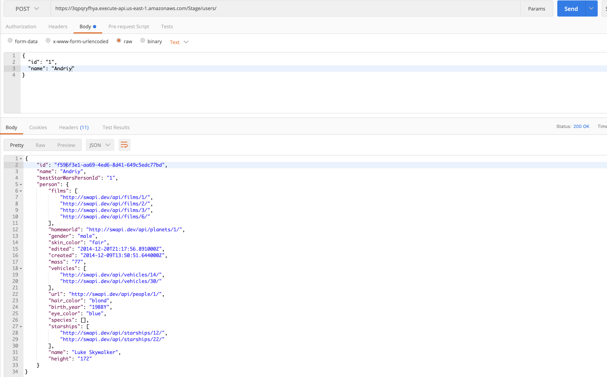
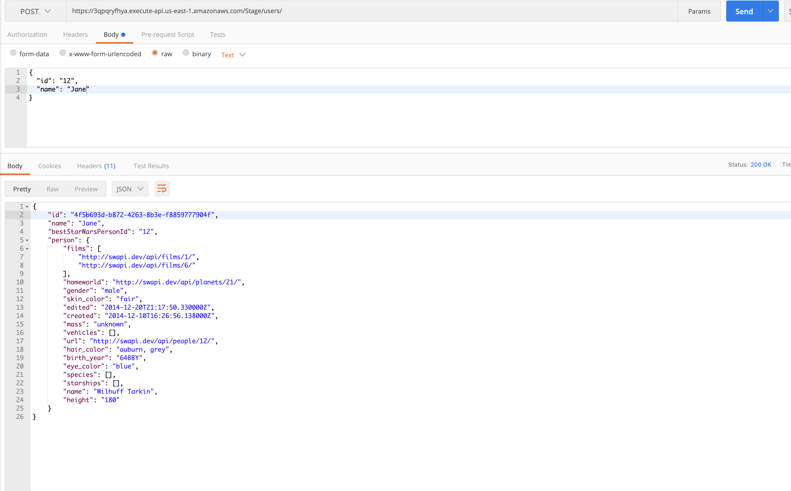
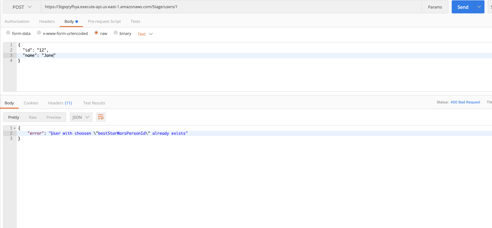
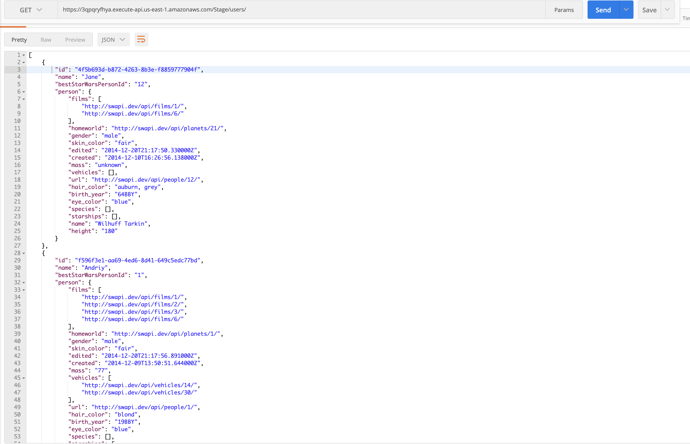
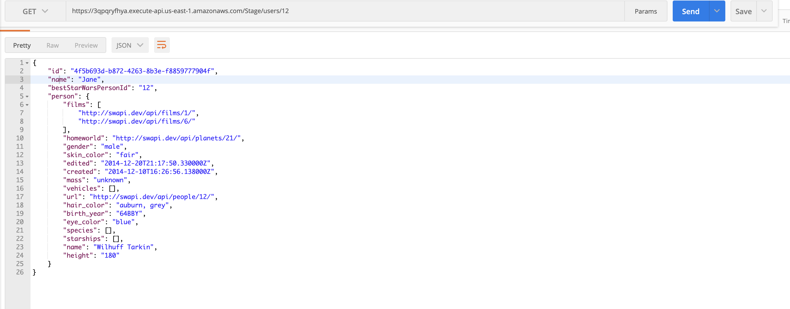
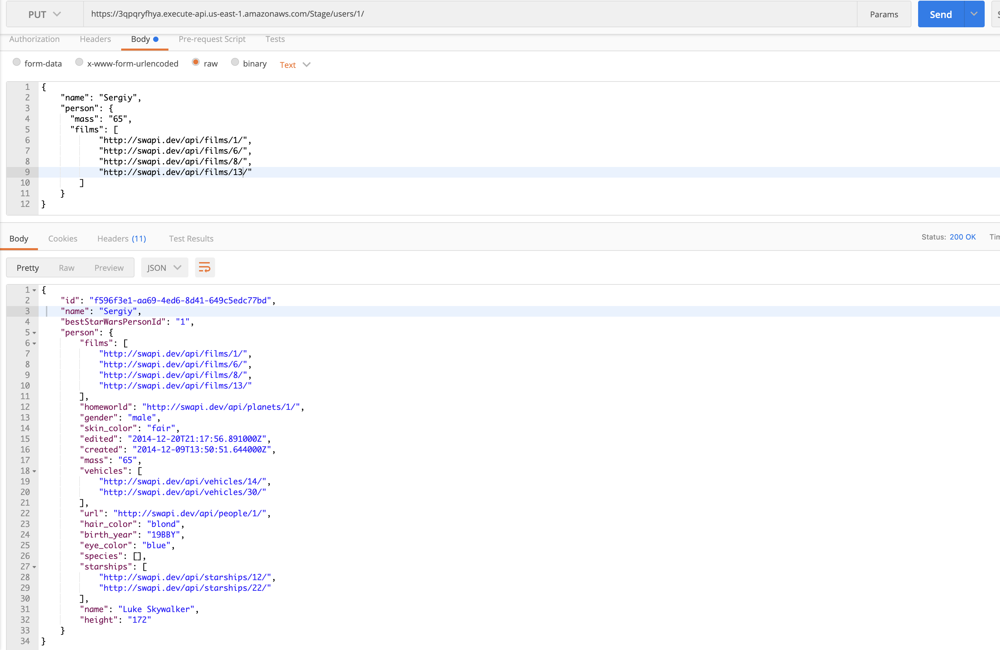
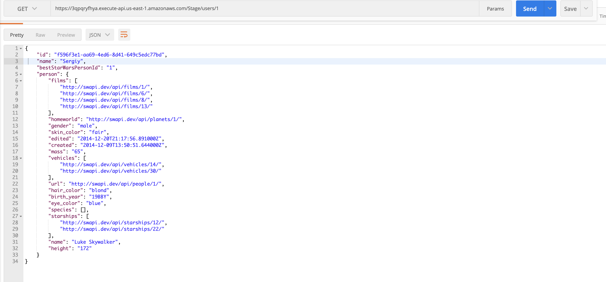
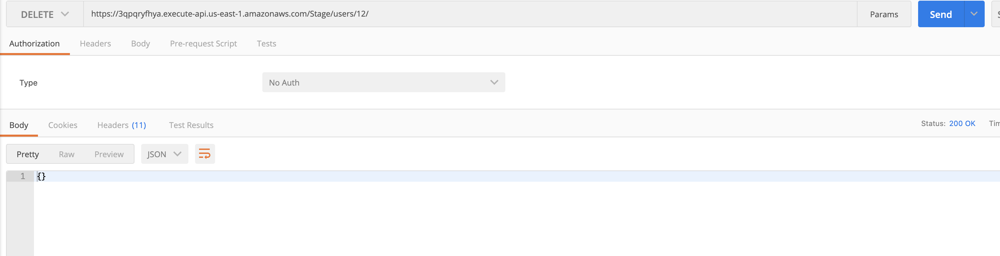
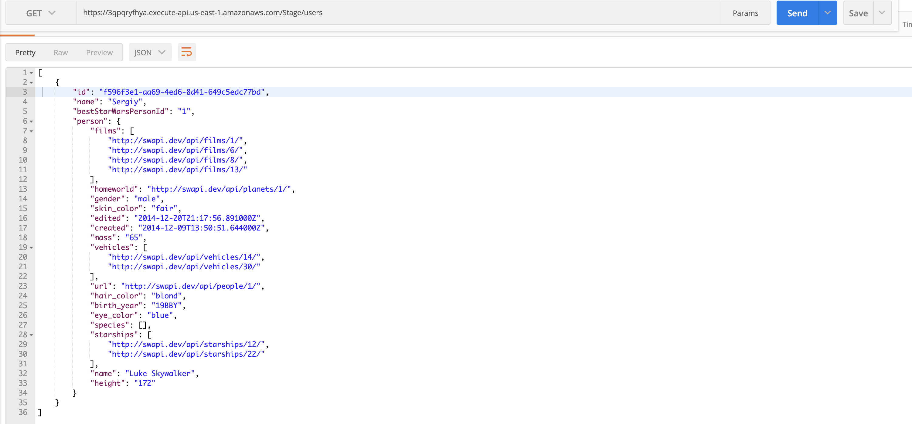

## Commands before packaging

```
cd /serverless/src/externalDepsLayer/nodejs/ && npm i
```

## Commands to package and deploy

```
sam package \
    --template-file template.yaml \
    --s3-bucket test-task-best-star-wars-persons \
    --output-template-file output-template.yaml
```

```
sam deploy \
    --template-file output-template.yaml \
    --stack-name test-stack-task-best-star-wars-persons \
    --capabilities CAPABILITY_IAM
```

<!-- sam deploy with ParameterUserPoolArn -->

```
sam deploy \
    --template-file output-template.yaml \
    --stack-name test-stack-task-best-star-wars-persons \
    --capabilities CAPABILITY_IAM \
    --parameter-overrides ParameterKey=ParameterUserPoolArn,
    ParameterValue=<"existing UserPooL.ARN">
```

### Lambda Function Code Flow



## Testing

### Add user





### Get list of users



### Get user



### Update user




### Delete user



